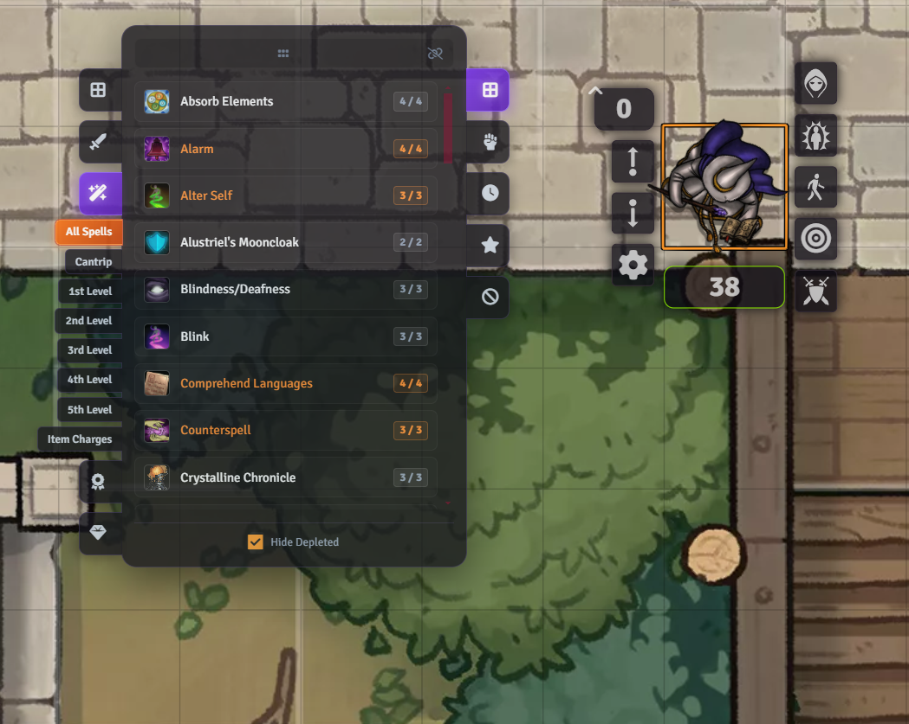

# Bakana's Action Display

A sleek, high-performance, and highly customizable **Action HUD** for **Foundry VTT (V12+)**.

**Bakana's Action Display** dynamically tracks your selected token on the canvas, instantly extracting and displaying their available attacks, spells, feats, and consumables. Designed with a premium, modern aesthetic, it helps players and GMs speed up combat by placing all their tactical options just one (or two) clicks away.

<video src="docs/readme-assets/hud_demo.mp4" width="100%" autoplay loop muted playsinline></video>

---

## Table of Contents
*   [Key Features](#key-features)
*   [How to Use](#how-to-use)
*   [System Exclusives](#system-exclusives)
    *   [D&D 5e Exclusives](#dd-5e-exclusives)
        *   [Midi-QOL Integration (Module)](#midi-qol-integration-module)
    *   [Pathfinder 2e Exclusives](#pathfinder-2e-exclusives)
    *   [Pathfinder 1e Exclusives](#pathfinder-1e-exclusives)
*   [Architecture & Extension](#architecture--extension)
*   [Configuration & Settings](#configuration--settings)
*   [Installation](#installation)
*   [License](#license)

---

## Key Features

*   **Dynamic Token Tracking**: Automatically follows your active or selected token, updating the HUD instantly as you switch selection.
*   **Dual-Tab Filtering**:
    *   **Left-Side Tabs**: Group actions by item type (Weapons, Spells, Feats, Consumables, etc.).
    *   **Right-Side Tabs**: Group actions by their action economy cost (Actions, Bonus Actions, Reactions, Passives, etc.).
*   **Right-Click Multi-Select**: Right-click on any sub-tab to toggle it, allowing you to combine categories (e.g., view both **Bonus Actions** and **Reactions** at the same time!).
*   **Floating / Detached Mode**: Drag the HUD anywhere on your screen—it will smoothly glide at 60fps and save its position. Click the anchor icon to re-attach it to tokens.
*   **Hide Depleted Resources**: Toggle the resource filter to instantly hide spells, activities, or items that have run out of slots, charges, or uses.
*   **Customizable Visibility**: Right-click any action card in the HUD to hide it. Unhide it anytime via the context menu.
*   **Left-Click Smart Dropdowns**: For items with multiple options (like a spell with multiple casting levels or a weapon with multiple activities), left-clicking opens a sleek dropdown to let you choose your option.

---

## How to Use

*   **Left-Click a Tab**: Selects that category exclusively.
*   **Right-Click a Tab**: Toggles that category in/out of your multi-select view.
*   **Left-Click an Action Card**: Rolls the action! If the action has multiple options, it opens a dropdown; click the option you want to roll.
*   **Right-Click an Action Card**: Opens the context menu to **Hide** or **Unhide** the action, or open the item's sheet.
*   **Drag the Top Handle**: Detaches the HUD and lets you drag it anywhere.
*   **Click the Anchor Icon ⚓**: Re-attaches the HUD to follow your selected token.
*   **Click the Checkbox ⚙️**: Toggles the **Hide Depleted Resources** filter.

<video src="docs/readme-assets/drag_hide_demo.mp4" width="100%" autoplay loop muted playsinline></video>

---

## System Exclusives

The module is built on a modular adapter pattern, allowing it to hook deeply into game systems to extract native rules, icons, and sorting algorithms. Below are the features exclusive to each supported system:

### D&D 5e Exclusives

#### 4.0 Activity System
Full support for D&D 5e's 4.0 Activity architecture. Items with multiple activities (e.g. a spell with an attack and a saving throw, or a sword with a cleave and a slash) are presented as a single card. Left-clicking the card expands it into a dropdown showing all its active activities, allowing you to choose which one to roll.


#### Prepared Spells Toggle
You can choose whether to show or hide unprepared spells in the HUD. A quick **right-click shortcut on the "All Spells" tab** allows you to toggle the visibility of unprepared spells instantly without opening the settings menu.



#### Midi-QOL Integration (Module)
When the `midi-qol` module is active, the Action Display HUD integrates automatically:
*   **Automation Filtering**: The HUD automatically scans activities and filters out any that are marked as **`automationOnly`** in their Midi-QOL properties. This prevents internal utility activities from cluttering your HUD.
*   **Smart Hiding**: If all activities on an item are marked as automation-only, the entire item card is automatically hidden from the HUD.

---

### Pathfinder 2e Exclusives

#### Strike Resolution
Unlike other systems where attacks are just items in the inventory, PF2e uses a complex derived "Strikes" system. The PF2e adapter dynamically extracts these Strikes (both weapon attacks and unarmed strikes like Fist or monster Claws) directly from `actor.system.actions`. 
*   **Ammunition Tracking**: Weapon strikes automatically display remaining ammunition (e.g., arrows for a bow) directly on the card.
*   **Synthetic Attacks**: Unarmed attacks are backed by synthetic items generated by the system, ensuring they always have icons and roll correctly.
<!-- [PLACEHOLDER: Screenshot - A PF2e character HUD showing weapon strikes with ammunition counters and unarmed strikes like Fist] -->

#### Numerical Spell Level Sorting
Spells in PF2e are grouped by level. The adapter automatically overrides alphabetical sorting for spell sub-tabs, ensuring they are sorted **numerically by spell level** (Cantrips, 1st, 2nd, 3rd...) for intuitive navigation.

---

### Pathfinder 1e Exclusives

#### Linked Attacks & Multi-Actions
In PF1, weapons often have multiple attack options, or are linked to specific attack items. The PF1 adapter automatically merges these:
*   **Linked Attack Merging**: If a weapon has linked attack items, the adapter merges them into a single HUD card. Left-clicking the card opens a dropdown listing all the linked attacks.
*   **Multi-Action Dropdowns**: Items with multiple defined actions are automatically presented with dropdowns, allowing you to choose which attack or formula to activate.
<!-- [PLACEHOLDER: Screenshot - A PF1 weapon card clicked, showing a dropdown containing its multiple attack/full-attack options] -->

#### Buff Tracking
PF1 relies heavily on temporary buffs. The adapter extracts active buffs and displays them in a dedicated **Buffs** tab, allowing you to view and manage them quickly.

---

## Architecture & Extension

This module is designed to be highly extensible. It uses a clean **Adapter Pattern** to decouple the core UI from system-specific and module-specific rules:

*   **System Adapters**: Manage how items are categorized, how rolls are triggered, and how system-specific resources are calculated. All system adapters inherit from `BaseSystemAdapter`.
*   **Module Adapters**: Intercept and modify actions based on other active modules (like Midi-QOL). All module adapters inherit from `BaseModuleAdapter`.

For a deep dive into the codebase architecture, lifecycle hooks, and instructions on how to write your own system or module adapters, please refer to our **[Architecture Guide](docs/architecture_guide.md)**.

---

## Configuration & Settings

Configure these options in the Foundry VTT Module Settings menu:
*   **HUD Position Mode**: Choose whether the HUD starts in `Attached` (following tokens) or `Detached` (floating) mode.
*   **Filter Out of Resources**: Enable or disable the resource filter by default.
*   **Theme & Styling**: Fully compatible with custom CSS. Overrides core Foundry styles cleanly.

---

## Installation

To install the module, copy the following Manifest URL into the **Install Module** dialog in the Foundry VTT Setup menu:

```text
https://github.com/aljames-arctic/bakana-action-display/releases/latest/download/module.json
```

---

## License

This project is licensed under the **MIT License** - see the [LICENSE](LICENSE) file for details.
