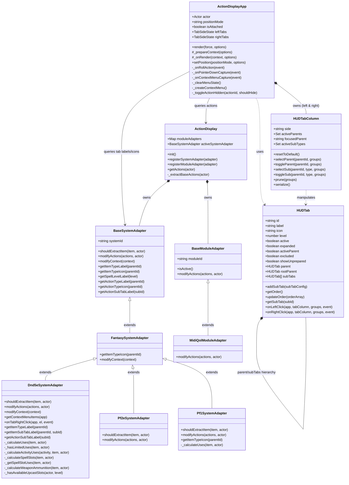
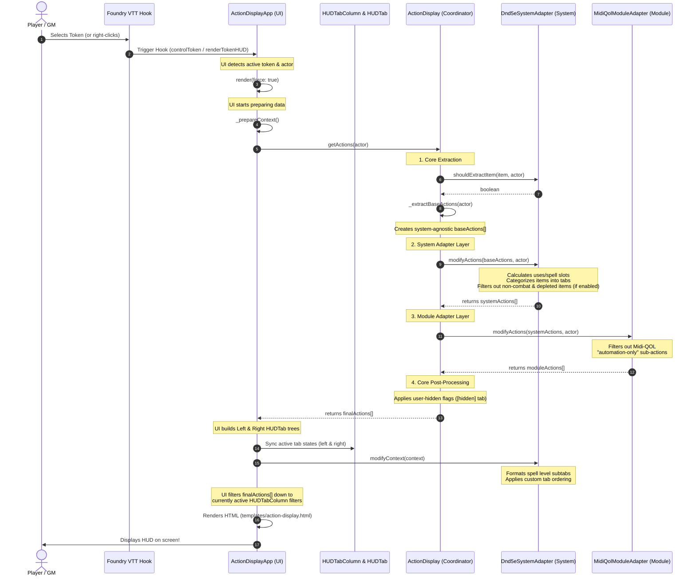

# Architecture & Lifecycle Guide

This document explains the architecture of **Bakana's Action Display** and provides a visual guide to how the different class layers integrate, culminating in the rendering of the Token HUD. For a complete function-by-function call tree and detailed API reference, see the **[Function Call Tree & Developer API Reference](function_tree.md)**.

---

## 1. Architectural Layers

The module is built using a clean **pipes-and-filters / adapter** architecture, divided into four distinct layers:

```
┌────────────────────────────────────────────────────────┐
│                        UI Layer                        │
│                (ActionDisplayApp)                      │
└──────────────────────────┬─────────────────────────────┘
                           │ queries actions & layout
                           ▼
┌────────────────────────────────────────────────────────┐
│                    Coordinator Layer                   │
│                    (ActionDisplay)                     │
└──────────────────────────┬─────────────────────────────┘
                           │ runs pipeline
                           ▼
┌────────────────────────────────────────────────────────┐
│                  System Adapter Layer                  │
│  (BaseSystemAdapter ◄─ FantasySystemAdapter ◄─ Dnd5e) │
└──────────────────────────┬─────────────────────────────┘
                           │ modifies & categorizes
                           ▼
┌────────────────────────────────────────────────────────┐
│                  Module Adapter Layer                  │
│      (BaseModuleAdapter ◄─── MidiQolModuleAdapter)     │
└───────────────────────────┬────────────────────────────┘
                            │ filters & augments
                            ▼
                    [ Final HUD Render ]
```

### 1. Core / Coordinator (`ActionDisplay`)
*   **Role**: The central pipeline controller (a singleton instance exported from `src/action-display.js`).
*   **Responsibilities**:
    *   Detects the active game system and registers the appropriate system and module adapters.
    *   Performs the **Core Extraction**: iterates over all items on an actor and extracts a basic, system-agnostic list of actions (name, image, item ID, and roll functions). Before extracting full item data, queries `shouldExtractItem` on the active system adapter to bypass unneeded allocations.
    *   Runs the pipeline: `Core Extraction ──► System Adapter ──► Module Adapters ──► Core Post-Processing (User-Hidden Filters)`.

### 2. System Adapter Layer (`BaseSystemAdapter` & `FantasySystemAdapter`)
*   **Role**: Handles system-specific rules, resource calculations, and terminology.
*   **Responsibilities**:
    *   **`BaseSystemAdapter`**: The core, genre-agnostic base class. It defines the interface for all adapters, provides item filtering hooks (`shouldExtractItem`), and fallback localizations for generic HUD tabs (like "All Items", "Other").
    *   **`FantasySystemAdapter`**: An intermediate class extending the base adapter. It houses shared defaults for fantasy RPG systems, such as default icon mappings for weapons, spells, feats, and consumables, as well as the numerical spell-level sorting algorithm and tab context modification (`modifyContext`).
    *   **Concrete Adapters** (e.g., `Dnd5eSystemAdapter`, `Pf1SystemAdapter`, `Pf2eSystemAdapter`): Inherit from `FantasySystemAdapter` to leverage shared fantasy defaults, while implementing system-specific resource calculations (like spell slots, activities, or ammunition) and custom tab mappings.
    *   Maps system-native entities into the generic HUD model (`item` = Item Card, `activities` = Sub-options/Activities):
        *   **D&D 5e**: `item` ──► `Item5e`, `activities` ──► `Activity5e` instances.
        *   **Pathfinder 2e**: `item` ──► `ItemPF2e` / `Strike`, `activities` ──► Strike options / weapon modes.
        *   **Pathfinder 1e**: `item` ──► `ItemPF1`, `activities` ──► Linked attack items / multi-action formulas.
    *   Filters out depleted actions if the "Filter Depleted Actions" setting is enabled, using system-specific rules.

### 3. Module Adapter Layer (`BaseModuleAdapter`)
*   **Role**: Handles third-party module integrations (like `midi-qol`) without cluttering the core or system layers.
*   **Responsibilities**:
    *   Inspects active module flags on actions and modifies them (e.g., filtering out Midi-QOL "automation-only" activities from the player-facing HUD).

### 4. UI Layer (`ActionDisplayApp`, `HUDTabColumn`, `HUDTab`, & `TabRef`)
*   **Role**: The rendering engine and state management system, built on Foundry VTT's modern `ApplicationV2` (`HandlebarsApplication`) framework.
*   **Responsibilities**:
    *   **`ActionDisplayApp`**: Listens to Foundry hooks (like token selection) to position and render the HUD. Manages attachment/detachment states, scroll position preservation (`scrollable` selector), and context rendering.
    *   **`HUDTabColumn`**: Encapsulates left and right column tab states (active parents, focused parent, active sub-types) and enforces click interaction rules (exclusive left-click parent selection, multi-stage right-click toggles, sub-tab isolation).
    *   **`HUDTab`**: A unified, recursive tab UI model representing top-level parent tabs, sub-tabs, and deeply nested sub-tabs with depth levels (`level` 0, 1, 2+), parent/rootParent pointers, and click event handlers (`onLeftClick`, `onRightClick`).
    *   **`TabRef`**: A structured tab data reference class (`src/ui/tab-ref.js`) attached to item activities (`item.tabs`, `activity.tabs`). Pre-computes `.root` parent IDs and `.path` hierarchy strings (e.g. `'economy/action'`) at construction.
    *   In `_prepareContext()`, it requests the processed actions from the Coordinator, queries the active system adapter for tab layouts, delegates tab context modification, filters actions to match active tabs, and renders `templates/action-display.html`.
    *   In `_onRollAction()`, it checks if an item has multiple `activities` and dynamically renders a left-click dropdown menu if needed.

---

## 2. Class Relationships

The following diagram shows how the classes are structured and how they reference one another:



---

## 3. The HUD Render Pipeline

This sequence diagram traces the exact lifecycle of how the HUD is created and rendered when a user selects a token in Foundry VTT:


