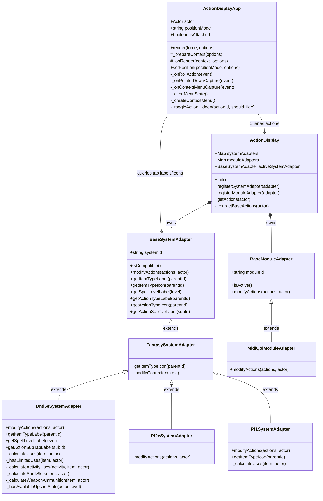
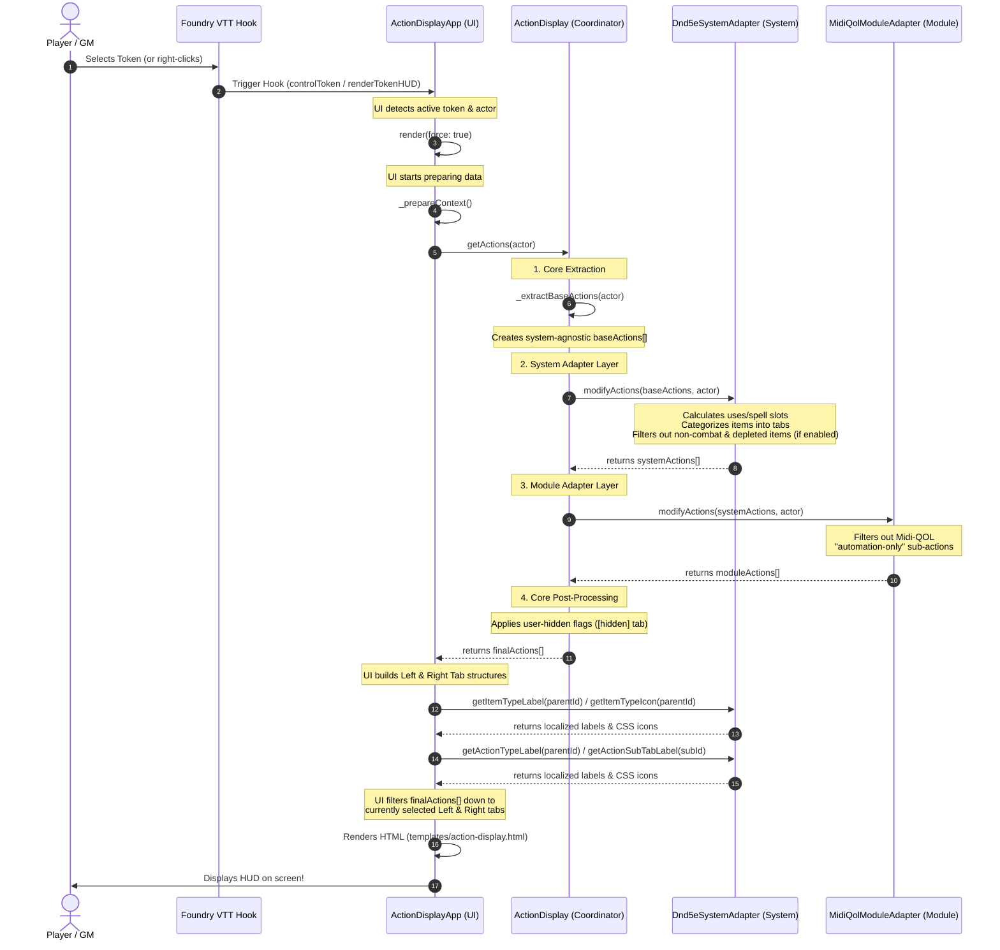

# Architecture & Lifecycle Guide

This document explains the architecture of **Bakana's Action Display** and provides a visual guide to how the different class layers integrate, culminating in the rendering of the Token HUD.

---

## 1. Architectural Layers

The module is built using a clean **pipes-and-filters / adapter** architecture, divided into four distinct layers:

```
┌────────────────────────────────────────────────────────┐
│                        UI Layer                        │
│                (ActionDisplayApp)                      │
└──────────────────────────┬─────────────────────────────┘
                           │ queries actions & layout
                           ▼
┌────────────────────────────────────────────────────────┐
│                    Coordinator Layer                   │
│                    (ActionDisplay)                     │
└──────────────────────────┬─────────────────────────────┘
                           │ runs pipeline
                           ▼
┌────────────────────────────────────────────────────────┐
│                  System Adapter Layer                  │
│  (BaseSystemAdapter ◄─ FantasySystemAdapter ◄─ Dnd5e) │
└──────────────────────────┬─────────────────────────────┘
                           │ modifies & categorizes
                           ▼
┌────────────────────────────────────────────────────────┐
│                  Module Adapter Layer                  │
│      (BaseModuleAdapter ◄─── MidiQolModuleAdapter)     │
└───────────────────────────┬────────────────────────────┘
                            │ filters & augments
                            ▼
                    [ Final HUD Render ]
```

### 1. Core / Coordinator (`ActionDisplay`)
*   **Role**: The central pipeline controller (a singleton instance exported from `src/action-display.js`).
*   **Responsibilities**:
    *   Detects the active game system and registers the appropriate system and module adapters.
    *   Performs the **Core Extraction**: iterates over all items on an actor and extracts a basic, system-agnostic list of actions (name, image, item ID, and roll functions).
    *   Runs the pipeline: `Core Extraction ──► System Adapter ──► Module Adapters ──► Core Post-Processing (User-Hidden Filters)`.

### 2. System Adapter Layer (`BaseSystemAdapter` & `FantasySystemAdapter`)
*   **Role**: Handles system-specific rules, resource calculations, and terminology.
*   **Responsibilities**:
    *   **`BaseSystemAdapter`**: The core, genre-agnostic base class. It defines the interface for all adapters and provides fallback localizations for generic HUD tabs (like "All Items", "Other").
    *   **`FantasySystemAdapter`**: An intermediate class extending the base adapter. It houses shared defaults for fantasy RPG systems, such as default icon mappings for weapons, spells, feats, and consumables, as well as the numerical spell-level sorting algorithm.
    *   **Concrete Adapters** (e.g., `Dnd5eSystemAdapter`, `Pf1SystemAdapter`, `Pf2eSystemAdapter`): Inherit from `FantasySystemAdapter` to leverage shared fantasy defaults, while implementing system-specific resource calculations (like spell slots, activities, or ammunition) and custom tab mappings.
    *   Populates a generic **`subActions`** array on actions that have multiple options, converting them into a system-agnostic format.
    *   Filters out depleted actions if the "Filter Depleted Actions" setting is enabled, using system-specific rules.

### 3. Module Adapter Layer (`BaseModuleAdapter`)
*   **Role**: Handles third-party module integrations (like `midi-qol`) without cluttering the core or system layers.
*   **Responsibilities**:
    *   Inspects active module flags on actions and modifies them (e.g., filtering out Midi-QOL "automation-only" sub-actions from the player-facing HUD).

### 4. UI Layer (`ActionDisplayApp`)
*   **Role**: The rendering engine, built on Foundry VTT's modern `ApplicationV2` (`HandlebarsApplication`) framework.
*   **Responsibilities**:
    *   Listens to Foundry hooks (like token selection) to position and render the HUD.
    *   Coordinates attachment/detachment states and tracks position coordinates.
    *   In `_prepareContext()`, it requests the processed actions from the Coordinator, queries the active system adapter for the tab layouts, filters the actions to match the active tabs, and renders the Handlebars template (`templates/action-display.html`).
    *   In `_onRollAction()`, it checks if an action has multiple `subActions` and dynamically renders a left-click dropdown menu if needed, remaining completely system-agnostic.

---

## 2. Class Relationships

The following diagram shows how the classes are structured and how they reference one another:



---

## 3. The HUD Render Pipeline

This sequence diagram traces the exact lifecycle of how the HUD is created and rendered when a user selects a token in Foundry VTT:


