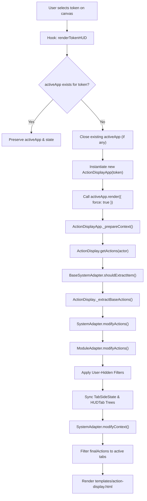
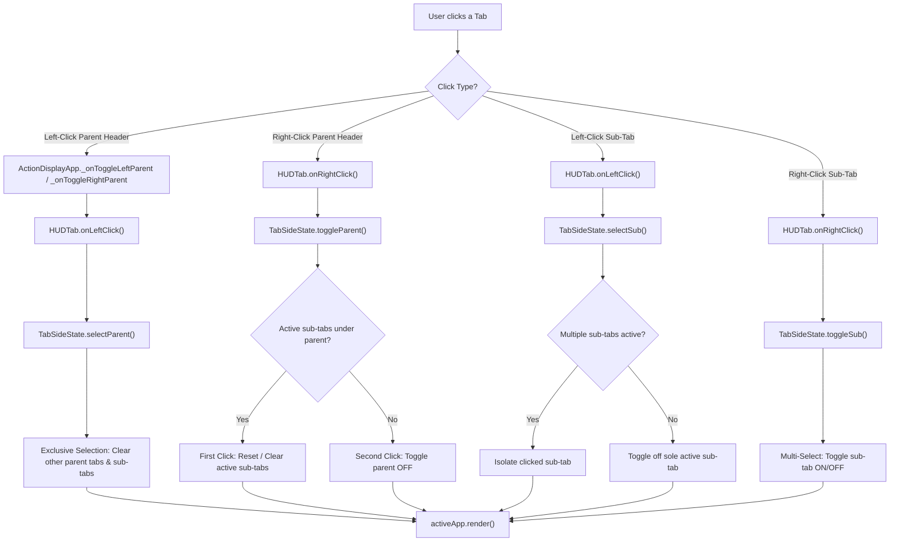
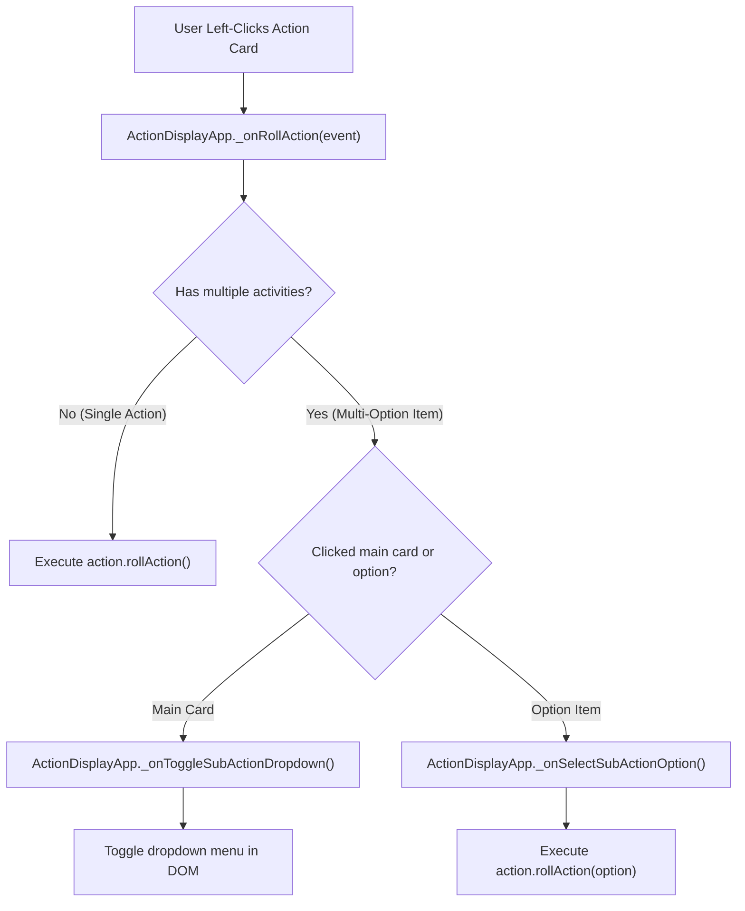
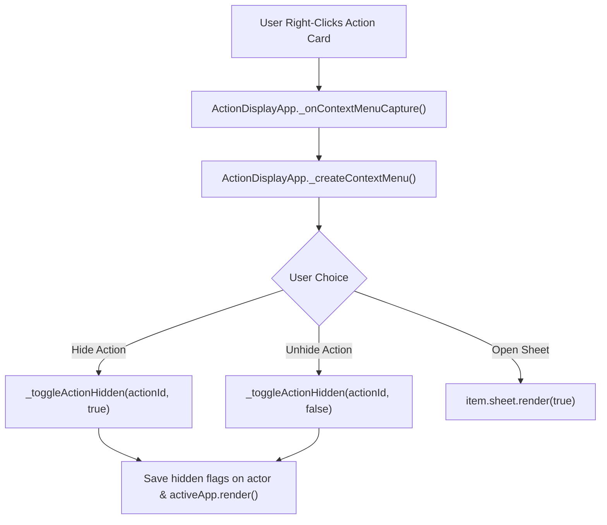

# Function Call Tree & Developer API Reference

This document provides a complete call tree and API reference for **Bakana's Action Display**. It details how hooks, class methods, state managers, and system adapters interact during rendering and user events.

---

## 1. Module Lifecycle & Event Call Tree

```
[Foundry VTT Hooks]
  │
  ├── Hooks.once('init')
  │    ├── registerAdapters()
  │    │    ├── import(systemAdapterPath) ──► actionDisplay.registerSystemAdapter()
  │    │    └── MODULE_ADAPTERS loop      ──► actionDisplay.registerModuleAdapter()
  │    ├── Token.prototype._onClickRight (Wrapped: flags closeDetachedHUD)
  │    └── actionDisplay.init()
  │
  ├── Hooks.once('ready')
  │    └── TokenHUD.prototype.clear & close (Wrapped: calls handleHUDClose())
  │
  ├── Hooks.on('renderTokenHUD')
  │    ├── if activeApp exists for token ──► return (preserve active instance)
  │    ├── if activeApp exists for other token ──► activeApp.close()
  │    └── activeApp = new ActionDisplayApp(token)
  │         └── activeApp.render({ force: true })
  │
  ├── Hooks.on('updateToken')
  │    ├── if detached ──► return
  │    ├── if movement-only change (x, y, rotation, elevation) ──► return
  │    └── activeApp.render()
  │
  ├── Hooks.on('refreshToken') / Hooks.on('canvasPan')
  │    └── if activeApp isAttached & rendered ──► activeApp.setPosition()
  │
  └── Hooks.on('updateActor') / Hooks.on('updateItem')
       └── activeApp.render()
```

---

## 2. Render & Data Processing Tree

When `activeApp.render()` is invoked, standard `ApplicationV2` context preparation flows through the Coordinator, System Adapters, Module Adapters, and UI state managers:

```
ActionDisplayApp.render()
  └── ActionDisplayApp._prepareContext(options)
       │
       ├── 1. Coordinator Data Pipeline
       │    └── ActionDisplay.getActions(actor)
       │         ├── BaseSystemAdapter.shouldExtractItem(item, actor)
       │         ├── ActionDisplay._extractBaseActions(actor)
       │         │    └── Iterates actor.items ──► creates baseActions[]
       │         ├── BaseSystemAdapter.modifyActions(baseActions, actor)
       │         │    └── System-specific logic (e.g. Dnd5eSystemAdapter, Pf2eSystemAdapter)
       │         │         ├── Calculates item uses, spell slots, ammunition
       │         │         ├── Builds subActions[] array for multi-option items
       │         │         └── Filters depleted actions (if setting enabled)
       │         ├── BaseModuleAdapter.modifyActions(systemActions, actor)
       │         │    └── Module-specific filters (e.g. MidiQolModuleAdapter automation-only filter)
       │         └── Core Post-Processing
       │              └── ActionDisplay.isActionHidden(actionId) ──► flags hidden actions
       │
       ├── 2. Tab State & Context Setup
       │    ├── Sync TabSideState instances (this.leftTabs & this.rightTabs)
       │    ├── Build HUDTab hierarchy trees (this.leftGroups & this.parentGroups)
       │    └── BaseSystemAdapter.modifyContext(context)
       │         └── Formats spell level subtabs & precomputes tab sort ordering
       │
       ├── 3. Action Filtering
       │    └── Filter finalActions[] against active TabSideState filters
       │         ├── leftTabs.activeParents & leftTabs.activeSubTypes
       │         └── rightTabs.activeParents & rightTabs.activeSubTypes
       │
       └── 4. Render Template
            └── Renders templates/action-display.html with scrollable container preserved
```

---

## 3. User Interaction & Event Call Tree

### A. Tab Interactions (Left & Right Columns)

```
[User Clicks Tab Header]
  │
  ├── Left-Click Parent Tab Header
  │    └── ActionDisplayApp._onToggleLeftParent / _onToggleRightParent
  │         └── HUDTab.onLeftClick(app, tabColumn, groups, event)
  │              └── HUDTabColumn.selectParent(parentId, groups)
  │                   ├── Exclusive selection: clears other parent tabs & their sub-tabs
  │                   └── Sole active parent with 0 active sub-tabs ──► resets side to default ('all')
  │
  ├── Right-Click Parent Tab Header
  │    └── ActionDisplayApp._onToggleLeftParentRightClick / _onToggleRightParent
  │         └── HUDTab.onRightClick(app, tabColumn, groups, event)
  │              └── HUDTabColumn.toggleParent(parentId, groups)
  │                   ├── First Click: Clears all active sub-tabs under this parent (reset shortcut)
  │                   └── Second Click: Toggles parent OFF (falls back to 'all' if no parents left active)
  │
  ├── Left-Click Sub-Tab Header
  │    └── ActionDisplayApp._onChangeLeftSubActionType / _onChangeSubActionType
  │         └── HUDTab.onLeftClick(app, tabColumn, groups, event)
  │              └── HUDTabColumn.selectSub(parentId, type, groups)
  │                   ├── Multiple sub-tabs active ──► isolates clicked sub-tab
  │                   └── Sole active sub-tab ──► toggles it off
  │
  └── Right-Click Sub-Tab Header
       └── ActionDisplayApp._onToggleLeftSub / _onToggleRightSub
            └── HUDTab.onRightClick(app, tabColumn, groups, event)
                 └── HUDTabColumn.toggleSub(parentId, type, groups)
                      └── Toggles sub-tab ON/OFF (multi-select)
```

### B. Action Card Interactions

```
[User Interacts with Action Card]
  │
  ├── Left-Click Action Card
  │    └── ActionDisplayApp._onRollAction(event)
  │         ├── Multiple subActions?
  │         │    ├── Target is already a subAction option ──► option.rollAction()
  │         │    └── Target is main card ──► ActionDisplayApp._onToggleSubActionDropdown(event)
  │         └── Single Action ──► action.rollAction()
  │
  └── Right-Click Action Card
       └── ActionDisplayApp._onContextMenuCapture(event)
            └── ActionDisplayApp._createContextMenu()
                 ├── Click "Hide Action"   ──► ActionDisplayApp._toggleActionHidden(actionId, true)
                 ├── Click "Unhide Action" ──► ActionDisplayApp._toggleActionHidden(actionId, false)
                 └── Click "Open Sheet"    ──► item.sheet.render(true)
```

---

## 4. Use Case Call Flowcharts & Source Links

### Flowchart 1: Token Selection & Initial HUD Render


**Flowchart 1 Source Code References:**
| Diagram Step | Function / Method | Source File & Line Number |
| :--- | :--- | :--- |
| **B** | `Hook: renderTokenHUD` | [`src/module.js`](../src/module.js#L136-L161) |
| **C, D, E** | `activeApp` lifecycle & instance check | [`src/module.js`](../src/module.js#L143-L155) |
| **F, G** | `new ActionDisplayApp(token)` & `.render()` | [`src/ui/action-display-app.js`](../src/ui/action-display-app.js#L25) / [`src/module.js`](../src/module.js#L158-L160) |
| **H** | `ActionDisplayApp._prepareContext()` | [`src/ui/action-display-app.js`](../src/ui/action-display-app.js#L119-L330) |
| **I** | `ActionDisplay.getActions(actor)` | [`src/action-display.js`](../src/action-display.js#L59-L104) |
| **J** | `BaseSystemAdapter.shouldExtractItem()` | [`src/adapters/system/base-system-adapter.js`](../src/adapters/system/base-system-adapter.js#L35-L37) |
| **K** | `ActionDisplay._extractBaseActions()` | [`src/action-display.js`](../src/action-display.js#L111-L141) |
| **L** | `BaseSystemAdapter.modifyActions()` | [`src/adapters/system/base-system-adapter.js`](../src/adapters/system/base-system-adapter.js#L45-L57) |
| **M** | `BaseModuleAdapter.modifyActions()` | [`src/adapters/module/base-module-adapter.js`](../src/adapters/module/base-module-adapter.js#L20) |
| **N** | Apply User-Hidden Filters | [`src/action-display.js`](../src/action-display.js#L85-L99) |
| **O** | Sync `TabSideState` & `HUDTab` Trees | [`src/ui/action-display-app.js`](../src/ui/action-display-app.js#L148-L310) |
| **P** | `BaseSystemAdapter.modifyContext()` | [`src/adapters/system/base-system-adapter.js`](../src/adapters/system/base-system-adapter.js#L146-L148) |
| **Q** | Filter `finalActions` to active tabs | [`src/ui/action-display-app.js`](../src/ui/action-display-app.js#L348-L455) |
| **R** | Render `templates/action-display.html` | [`templates/action-display.html`](../templates/action-display.html) |

---

### Flowchart 2: Tab Click & State Modification


**Flowchart 2 Source Code References:**
| Diagram Step | Function / Method | Source File & Line Number |
| :--- | :--- | :--- |
| **C** | `ActionDisplayApp._onToggleLeftParent / _onToggleRightParent` | [`src/ui/action-display-app.js`](../src/ui/action-display-app.js#L580-L605) |
| **D, M** | `HUDTab.onLeftClick()` | [`src/ui/hud-tab.js`](../src/ui/hud-tab.js#L163-L173) |
| **E, F** | `TabSideState.selectParent()` & Exclusive Selection | [`src/ui/tab-side-state.js`](../src/ui/tab-side-state.js#L60-L90) |
| **G** | `activeApp.render()` | [`src/ui/action-display-app.js`](../src/ui/action-display-app.js#L588) |
| **H, R** | `HUDTab.onRightClick()` | [`src/ui/hud-tab.js`](../src/ui/hud-tab.js#L182-L192) |
| **I, J, K, L** | `TabSideState.toggleParent()` (Multi-stage toggle) | [`src/ui/tab-side-state.js`](../src/ui/tab-side-state.js#L97-L135) |
| **N, O, P, Q** | `TabSideState.selectSub()` & Sub-tab Isolation | [`src/ui/tab-side-state.js`](../src/ui/tab-side-state.js#L143-L189) |
| **S, T** | `TabSideState.toggleSub()` (Multi-select toggle) | [`src/ui/tab-side-state.js`](../src/ui/tab-side-state.js#L197-L223) |

---

### Flowchart 3: Rolling Actions & Multi-Option Dropdowns


**Flowchart 3 Source Code References:**
| Diagram Step | Function / Method | Source File & Line Number |
| :--- | :--- | :--- |
| **B, C** | `ActionDisplayApp._onRollAction()` & `item.activities` check | [`src/ui/action-display-app.js`](../src/ui/action-display-app.js#L678-L700) |
| **D** | `action.roll()` (Single Action) | [`src/action-display.js`](../src/action-display.js#L127-L135) / [`src/ui/action-display-app.js`](../src/ui/action-display-app.js#L841) |
| **E, F, G** | Multi-Option Dropdown Menu | [`src/ui/action-display-app.js`](../src/ui/action-display-app.js#L761-L831) |
| **H, I** | Sub-Action Option Roll | [`src/ui/action-display-app.js`](../src/ui/action-display-app.js#L785-L788) |

---

### Flowchart 4: Right-Click Action Card & Context Menu


**Flowchart 4 Source Code References:**
| Diagram Step | Function / Method | Source File & Line Number |
| :--- | :--- | :--- |
| **B** | `ActionDisplayApp._onContextMenuCapture()` | [`src/ui/action-display-app.js`](../src/ui/action-display-app.js#L1080) |
| **C, D** | `ActionDisplayApp._createContextMenu()` | [`src/ui/action-display-app.js`](../src/ui/action-display-app.js#L1085-L1155) |
| **E** | `_toggleActionHidden(actionId, true)` (Hide) | [`src/ui/action-display-app.js`](../src/ui/action-display-app.js#L1098) / [`L1161-L1190`](../src/ui/action-display-app.js#L1161-L1190) |
| **F** | `_toggleActionHidden(actionId, false)` (Unhide) | [`src/ui/action-display-app.js`](../src/ui/action-display-app.js#L1112) / [`L1161-L1190`](../src/ui/action-display-app.js#L1161-L1190) |
| **G** | `item.sheet.render(true)` (Open Sheet) | [`src/ui/action-display-app.js`](../src/ui/action-display-app.js#L1121) |
| **H** | Save hidden flags & `activeApp.render()` | [`src/ui/action-display-app.js`](../src/ui/action-display-app.js#L1175-L1188) |

---

## 5. Class & Module Method Reference

### [`src/action-display.js`](../src/action-display.js) — Coordinator (`ActionDisplay`)
- [**`init()`**](../src/action-display.js#L20-L27): Initializes the coordinator instance.
- [**`registerSystemAdapter(adapter)`**](../src/action-display.js#L33-L39): Registers the active system adapter.
- [**`registerModuleAdapter(adapter)`**](../src/action-display.js#L45-L51): Registers an active module adapter.
- [**`getActions(actor)`**](../src/action-display.js#L59-L104): Executes the main 4-stage action processing pipeline for an actor.
- [**`_extractBaseActions(actor)`**](../src/action-display.js#L111-L141): Extracts system-agnostic base actions from an actor's item inventory.

### [`src/ui/action-display-app.js`](../src/ui/action-display-app.js) — UI Window (`ActionDisplayApp`)
- [**`_prepareContext(options)`**](../src/ui/action-display-app.js#L119-L330): Prepares context data, triggers coordinator pipeline, and builds tab trees.
- [**`_onRender(context, options)`**](../src/ui/action-display-app.js#L846-L1038): Attaches DOM event listeners and scroll position listeners.
- [**`setPosition(positionMode, options)`**](../src/ui/action-display-app.js#L1145-L1225): Calculates 60fps HUD positioning relative to token or detached coordinates.
- [**`_onRollAction(event)`**](../src/ui/action-display-app.js#L644-L845): Triggers action rolls or toggles multi-option dropdowns.
- [**`_createContextMenu()`**](../src/ui/action-display-app.js#L1043-L1114): Spawns custom right-click context menu for action cards.
- [**`_toggleActionHidden(actionId, shouldHide)`**](../src/ui/action-display-app.js#L1117-L1143): Flags an action card as hidden/unhidden and re-renders.

### [`src/ui/hud-tab-column.js`](../src/ui/hud-tab-column.js) — Tab Column Manager (`HUDTabColumn`)
- [**`constructor({ side, cached, getDefaultSubTypes })`**](../src/ui/hud-tab-column.js#L14-L33): Initializes left or right tab column state.
- [**`resetToDefault()`**](../src/ui/hud-tab-column.js#L38-L48): Resets column to `'all'` parent and default sub-types.
- [**`selectParent(parentId, groups)`**](../src/ui/hud-tab-column.js#L60-L90): Handles exclusive left-click parent selection.
- [**`toggleParent(parentId, groups)`**](../src/ui/hud-tab-column.js#L97-L135): Handles multi-stage right-click parent toggling.
- [**`selectSub(parentId, type, groups)`**](../src/ui/hud-tab-column.js#L143-L189): Handles left-click sub-tab isolation/toggling.
- [**`toggleSub(parentId, type, groups)`**](../src/ui/hud-tab-column.js#L197-L223): Handles right-click sub-tab multi-select toggles.
- [**`prune(groups)`**](../src/ui/hud-tab-column.js#L229-L244): Removes sub-types that are no longer present in active parent tabs.
- [**`serialize()`**](../src/ui/hud-tab-column.js#L250-L256): Exports tab state for per-actor persistence.

### [`src/ui/hud-tab.js`](../src/ui/hud-tab.js) — Unified Tab Node (`HUDTab`)
- [**`constructor(options)`**](../src/ui/hud-tab.js#L23-L55): Instantiates a tab node with depth `level`, `rootParent`, and child `subTabs`.
- [**`addSubTab(subTabConfig)`**](../src/ui/hud-tab.js#L115-L122): Appends a child sub-tab, updating parent and level references.
- [**`getOrder()`**](../src/ui/hud-tab.js#L128-L130): Returns array of child sub-tab IDs in display order.
- [**`updateOrder(orderArray)`**](../src/ui/hud-tab.js#L136-L140): Re-orders child sub-tabs matching an ordered ID array.
- [**`getSubTab(subId)`**](../src/ui/hud-tab.js#L146-L154): Recursively searches for a sub-tab node by ID.
- [**`onLeftClick(app, tabColumn, groups, event)`**](../src/ui/hud-tab.js#L163-L173): Executes left-click selection logic.
- [**`onRightClick(app, tabColumn, groups, event)`**](../src/ui/hud-tab.js#L182-L192): Executes right-click toggle logic.

### [`src/ui/tab-ref.js`](../src/ui/tab-ref.js) — Structured Tab Data Reference (`TabRef`)
- [**`constructor({ label, parent })`**](../src/ui/tab-ref.js#L11-L18): Instantiates a pre-computed tab data node linked to parent nodes, caching `.root` and `.path` string (`'economy/action'`).
- [**`get parentId`**](../src/ui/tab-ref.js#L26-L28): Returns direct parent ID or root ID.

### [`src/adapters/system/base-system-adapter.js`](../src/adapters/system/base-system-adapter.js) — System Adapter Interface (`BaseSystemAdapter`)
- [**`_createRollEvent(event)`**](../src/adapters/system/base-system-adapter.js#L23-L42): Creates a proxy around a roll event to inject keyboard modifiers (`Alt`, `Control`, `Shift`).
- [**`shouldExtractItem(item, actor)`**](../src/adapters/system/base-system-adapter.js#L51-L53): Performance filter to bypass unneeded item allocations.
- [**`modifyActions(actions, actor)`**](../src/adapters/system/base-system-adapter.js#L61-L73): Modifies base actions with system-specific calculations.
- [**`modifyContext(context)`**](../src/adapters/system/base-system-adapter.js#L162-L164): Customizes tab layout context and sub-tab ordering.
- [**`getItemTypeLabel(parentId)`**](../src/adapters/system/base-system-adapter.js#L80-L87) / [**`getItemTypeIcon(parentId)`**](../src/adapters/system/base-system-adapter.js#L94-L101): Returns tab labels and font-awesome icons.
- [**`getSpellLevelLabel(level)`**](../src/adapters/system/base-system-adapter.js#L109-L111): Localizes spell level sub-tab labels.

### [`src/adapters/system/dnd5e-system-adapter.js`](../src/adapters/system/dnd5e-system-adapter.js) — D&D 5e System Adapter (`Dnd5eSystemAdapter`)
- [**`shouldExtractItem(item)`**](../src/adapters/system/dnd5e-system-adapter.js#L49-L59): Filters out unallowed item types, helper items, and unequipped tools/consumables.
- [**`modifyActions(actions, actor)`**](../src/adapters/system/dnd5e-system-adapter.js#L67-L266): Processes D&D 5e activities, spell preparation, equipment states, and subcategory itemTypes.
- [**`modifyContext(context, app)`**](../src/adapters/system/dnd5e-system-adapter.js#L285-L323): Injects "All Spells", "All Weapons", and "All Equipment" sub-tabs and orders subcategory sub-tabs.
- [**`getContextMenuItems(app)`**](../src/adapters/system/dnd5e-system-adapter.js#L330-L418): Spawns context menu options for spell preparation (`Prepare`/`Unprepare`) and equipment management (`Equip`/`Unequip`).
- [**`onTabRightClick(app, el, event)`**](../src/adapters/system/dnd5e-system-adapter.js#L427-L445): Toggles unprepared spell visibility (`showUnprepared`) and unequipped weapon/equipment visibility (`showUnequipped_weapon`, `showUnequipped_equipment`).
