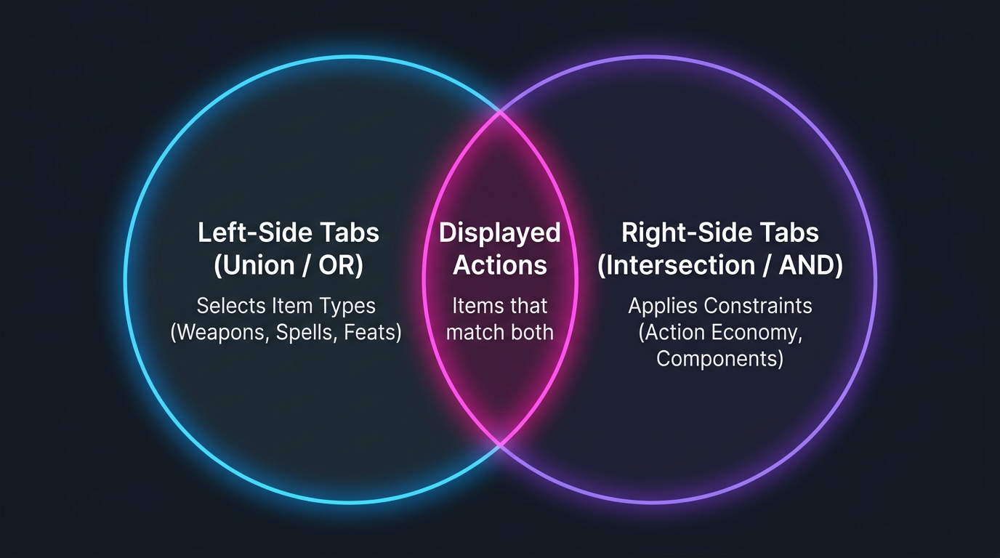

# Release Notes: The Dual-Axis Filtering Update 🎯

This release introduces a major overhaul to the HUD's filtering engine, bringing a highly intuitive **dual-axis filtering model** that makes managing your character's actions during tense combat encounters smoother than ever.

To help your players understand how the math works, here is a quick breakdown of the new logic, represented by this beautiful Venn diagram:

---

### 1. Left-Side Tabs: Item Selection (Union / `OR`)
The left-side tabs (Weapons, Spells, Feats, Consumables) act as **additive filters**. 
* Selecting multiple categories **unions** them together.
* *Example*: Selecting **Weapons** and **Spells** will display all items that are Weapons **OR** Spells.
* **Math**: `Selected Items = Weapons ∪ Spells`

### 2. Right-Side Tabs: Action Constraints (Intersection / `AND`)
The right-side tabs (Action Economy, Spell Components) act as **restrictive filters** that apply directly to your selected items.
* Selecting multiple constraints **intersects** them.
* *Example*: Selecting **Bonus Action** (Action Economy) and banning **Verbal** (Spell Components) will restrict your display to only items that are Bonus Actions **AND** do not require Verbal components.
* **Math**: `Displayed Items = (Selected Left Items) ∩ (Bonus Actions) ∩ (No Verbal)`

---

### 3. Special Right-Side UX Refinements
* **Action Economy (Positive Filter)**: Starts with **All Actions** active by default. Left-clicking an option (like *Action*) isolates it exclusively, while right-clicking allows you to toggle multiple options (e.g. viewing both *Bonus Actions* and *Reactions*).
* **Spell Components (Negative/Exclusion Filter)**: Starts with **none banned** by default (all spells allowed). Right-clicking a component (Verbal, Somatic, Material) **bans** it (marked with a red outline and diagonal slash), hiding any spells that require it. This is perfect for instantly seeing what you can cast when silenced or bound!
* **Persistent Tab Expansion**: Any parent tab that has active filters will **remain expanded** on your screen, even if you left-click to focus the *Action Economy* tab, allowing you to combine filters.
* **Reset Shortcut**: Simply **right-click a parent tab header** (like *Action Economy* or *Spell Components*) to instantly reset its sub-tabs to their default states while keeping the tab open.
